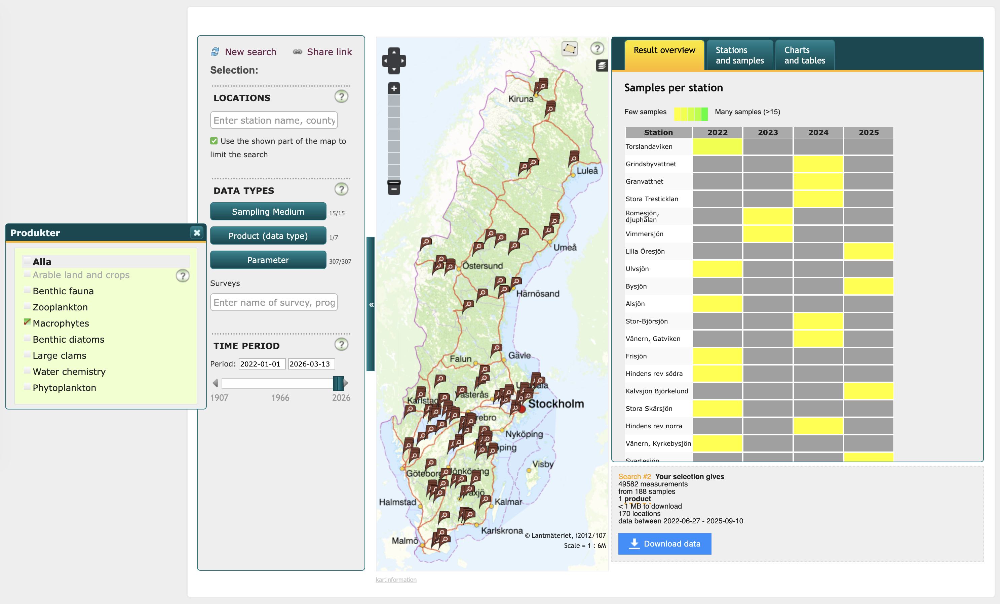
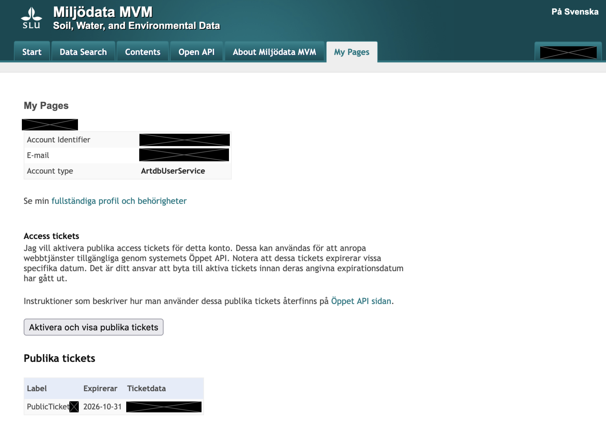

# Overview

Public GitHub repository for downloading Swedish freshwater aquatic plant and water chemistry data, combining them into a single dataset, and performing analysis. Companion script to manuscript under review.

Main files are
* `1-s2.0-S0304377019300300-mmc2.xlsx`: List from [Murphy et al., 2019](https://doi.org/10.1016/j.aquabot.2019.06.006) of main vascular plants considered as "aquatic". Downloaded from [supplementary material](https://ars.els-cdn.com/content/image/1-s2.0-S0304377019300300-mmc2.xlsx).
* `Miljödata MVM - Administrera kontrollhalter.csv`: Manual download of the [official documentation](https://miljodata.slu.se/mvm/DataContents/UnitConversion) for chemistry variable units and conversion factors.
* `seChemAPI.R`: Raw companion chemistry download and cleaning into long format.
    * Requires `Miljödata MVM - Administrera kontrollhalter.csv` for units.
* `seDataCombine.R`: Combining chemistry and plant data together into a single wide dataset.
    * Run after `seChemAPI.R` and `seMacroAPI.R`.
    * Requires `1-s2.0-S0304377019300300-mmc2.xlsx` for diversity calculation.
* `seMacroAPI.R`: Raw plant data download and cleaning into wide format.
* `seSpatialModels.R`: Running several [`spCF`](https://cran.r-project.org/package=spCF) models for spatial analysis on the data.
    * Run after `seDataCombine.R`.

# Text Summary

All data came from the Swedish environmental data service [Miljödata MVM](https://miljodata.slu.se/MVM/). Users can download data either through the search portal or through API. The [search portal](https://miljodata.slu.se/MVM/Search) provides csv files adhering to user-specified conditions (e.g., specific data products, time ranges, geographic locations, and survey type filters). In addition to diminished replicability, this option provides data at only the lake (i.e., station) level and excludes certain covariates (e.g., abundance, sampling methods, inorganic substrate, survey depth, and transect ID). Downloads cannot exceed 1 million data points per query, which is especially limiting for water chemistry time series.


_Figure 1: Online Miljödata MVM open access portal for direct data download to csv file, with a demonstration of Macrophyte product filters and spatiotemporal coverage options and visualisation._

Data at the site level need to be downloaded via API. The process starts with account registration using the [SLU portal](https://useradmin.slu.se/skapa-konto). After login, the website automatically redirects to the ["My Pages" portal](https://miljodata.slu.se/MVM/User/MyPages). Here, clicking on "Aktivera och visa publika tickets" shows an API key under "Ticketdata" that can be directly pasted into our data download scripts.


_Figure 2: Example Miljödata MVM account portal for registered users, with censored fields for private information. Users request public tokens for API access (i.e., not personal tokens but shared among all users) through the lower "Access tickets" section._

With the API key, we first downloaded macrophyte data using `seMacroAPI.R`. Then, we cleaned to a tidy dataframe format where each row is a sampling site surveyed at one timepoint. We took several processing steps to make the data more suitable for analysis:
1.	Remove columns on internal data quality from Swedish databases;
2.	Translate column names to English;
3.	Retain only the minimum and maximum transect start and end coordinates;
4.	Recode inorganic substrate to an ordered categorical variable;
5.	Clean species names by converting common to scientific names, removing all intraspecific identifiers, setting remaining hybrids to the genus level, and keeping only vascular plant, bryophyte, and charophyte algae taxa;
6.	Treat genera with only one recorded species at the species level for biodiversity analysis;
7.	Set ranges for Secchi depth to their midpoint and values exceeding the maximum to 10% over the limit;
8.	Select only sites with valid spatial coordinates; and
9.	Select only the first survey occurrence for each site to minimise bias from surveyor experience during resurveys.

Then, we repeated a similar process for the water chemistry data in `seChemAPI.R`. In contrast to the community data, we formatted observations into a long format where each row corresponds to a chemistry parameter at a site sampled at a specific timepoint. As a result, our processing differed slightly:
1.	Select only stations with macrophyte data;
2.	Choose 36 common macroecological variables (i.e., no pollution measures);
3.	Set values below the detection limit to half (50%) of the limit;
4.	Set values over the detection limit to 10% over the limit;
5.	Harmonise different units using `Miljödata MVM - Administrera kontrollhalter.csv`;
6.	Remove most quality and sampling covariates to avoid confusion with ecological data; and
7.	Select only the value from the shallowest recorded depth to improve comparability with other datasets [(García-Girón et al., 2020)](https://doi.org/10.1002%2Flno.11559).

Finally, we combined these macrophyte community and water chemistry downloads into a single dataset where each row was the macrophyte richness and corresponding chemistry data at one site in one year for analysis in `seDataCombine.R`. This warranted a few additional assumptions:
1.	Select only chemistry values during the May-September macrophyte survey season, and take a weighted average preferring data during summer months (i.e., June-August);
2.	Remove chemistry variables with more than 25% missing values; and
3.	Further calculate vascular macrophyte species richness using `1-s2.0-S0304377019300300-mmc2.xlsx`.

From this, we got 425 Swedish WFD sampling sites between 2007 and 2024 with recorded macrophyte richness, of which 202 had at least one water quality variable. Only lakes had available macrophyte community data, excluding lotic systems with water quality data. The data had multiple observations for every year of surveying, spatially distributed across the entirety of Sweden but with varying granularity depending on the geographic area (e.g., many sites concentrated around Stockholm).

# Session Info

Code was most recently run in the below environment.
```
R version 4.5.2 (2025-10-31 ucrt)
Platform: x86_64-w64-mingw32/x64
Running under: Windows 11 x64 (build 26200)

Matrix products: default
  LAPACK version 3.12.1

attached base packages:
[1] stats     graphics  grDevices utils     datasets  methods   base     

other attached packages:
 [1] here_1.0.2         readxl_1.4.5       jsonlite_2.0.0    
 [4] httr_1.4.7         ggpattern_1.3.1    sf_1.0-22         
 [7] viridis_0.6.5      viridisLite_0.4.2  ggcorrplot_0.1.4.1
[10] spCF_0.1.1         lubridate_1.9.4    forcats_1.0.1     
[13] stringr_1.6.0      dplyr_1.2.1        purrr_1.2.0       
[16] readr_2.1.6        tidyr_1.3.1        tibble_3.3.0      
[19] ggplot2_4.0.3      tidyverse_2.0.0    devtools_2.4.6    
[22] usethis_3.2.1     

loaded via a namespace (and not attached):
 [1] dotCall64_1.2      gtable_0.3.6       spam_2.11-1       
 [4] remotes_2.5.0      lattice_0.22-7     tzdb_0.5.0        
 [7] vctrs_0.7.3        tools_4.5.2        generics_0.1.4    
[10] proxy_0.4-27       pkgconfig_2.0.3    Matrix_1.7-4      
[13] KernSmooth_2.23-26 RColorBrewer_1.1-3 S7_0.2.1          
[16] lifecycle_1.0.5    compiler_4.5.2     farver_2.1.2      
[19] FNN_1.1.4.1        fields_17.1        maps_3.4.3        
[22] class_7.3-23       pillar_1.11.1      nloptr_2.2.1      
[25] ellipsis_0.3.2     classInt_0.4-11    cachem_1.1.0      
[28] dbscan_1.2.4       sessioninfo_1.2.3  tidyselect_1.2.1  
[31] stringi_1.8.7      rprojroot_2.1.1    fastmap_1.2.0     
[34] grid_4.5.2         cli_3.6.5          magrittr_2.0.4    
[37] pkgbuild_1.4.8     e1071_1.7-16       withr_3.0.2       
[40] scales_1.4.0       timechange_0.3.0   gridExtra_2.3     
[43] cellranger_1.1.0   ranger_0.17.0      hms_1.1.4         
[46] memoise_2.0.1      rlang_1.2.0        Rcpp_1.1.0        
[49] glue_1.8.0         DBI_1.2.3          pkgload_1.4.1     
[52] rstudioapi_0.17.1  R6_2.6.1           fs_1.6.6          
[55] units_1.0-0
```